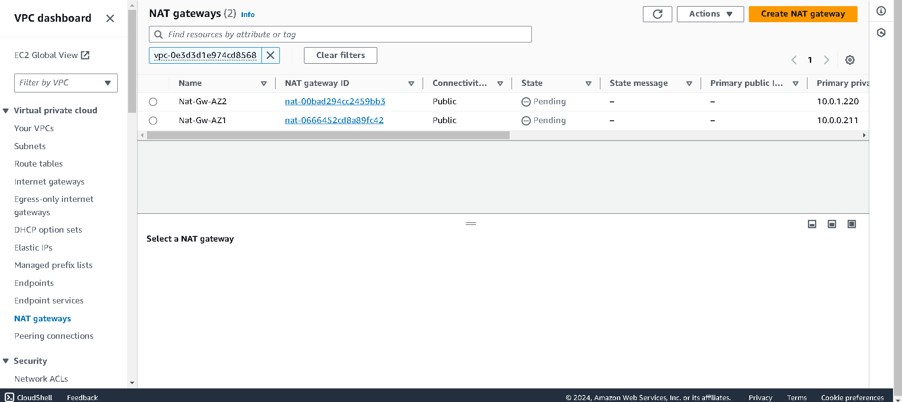

# AWS_Three-Tier_Web_Architecture

AWS Three-Tier Web Architecture Workshop
Overview
This workshop demonstrates the steps to set up a scalable and secure three-tier web architecture on AWS. The architecture consists of a public-facing Application Load Balancer that forwards client traffic to Nginx web servers on EC2 instances. These servers serve a React.js website and redirect API calls to an internal Application Load Balancer. The internal load balancer forwards traffic to a Node.js application tier, which interacts with an Aurora MySQL multi-AZ database and returns data to the web tier. The architecture ensures high availability and scalability using load balancers, health checks, and autoscaling groups at each layer.

### Architecture Diagram


### Learning Objectives
- S3 Bucket Creation
- IAM EC2 Instance Role Creation
- Download Code from GitHub Repository
- VPC and Networking Setup
- Security Group Configuration
- Database Deployment
- Application and Web Tier Deployment
- Load Balancing and Auto Scaling
- Resource Cleanup

## Prerequisites

1. AWS Account
- Basic knowledge of AWS services

2. Git installed on your local machine

## Project Steps
Step 1: Download Code from GitHub
```bash
git clone https://github.com/aws-samples/aws-three-tier-web-architecture-workshop.git
```
Step 2: S3 Bucket Creation
- Create an S3 bucket to store your application code.
  

Step 3: IAM EC2 Instance Role Creation
- Navigate to the IAM dashboard in the AWS console.
- Create an EC2 role with the following managed policies:
  `AmazonSSMManagedInstanceCore`
 `AmazonS3ReadOnlyAccess`
- Name the role and click "Create Role".


Step 4: Networking and Security

Part 1: VPC Creation
- Navigate to the VPC dashboard.
- Create a new VPC.
- Create subnets within the VPC for each layer (web, app, database).


1A: Subnet Creation
- Navigate to Subnets and create subnets for each layer.
- Ensure subnets are in different availability zones for high availability.


1B: Internet Connectivity
- Create and attach an Internet Gateway.


- Create NAT Gateways in each public subnet for internet access.

 

1C: Routing Configuration
- Create route tables for public and private subnets.

- Associate route tables with the appropriate subnets.

  

1D: Security Groups

- Create security groups for each layer (web, app, database).
- Configure inbound and outbound rules to control traffic between layers.


Part 2: Database Deployment

Step1:Subnet Groups
- Navigate to the RDS dashboard.
- Create a DB subnet group and add the database subnets.


Step2:Create an Aurora MySQL database.
- Configure the database for multi-AZ deployment.
- Disable public access to the database.


Part 3: App Tier Instance Deployment

App Instance Deployment

- Launch EC2 instances for the app tier in private subnets.
- Assign the IAM role created earlier.
- Configure the instances with the app tier security group.

Connect to Instance

- Use AWS Systems Manager Session Manager to connect to the instances.


- Install MySQL CLI and connect to the Aurora database.
- Ping 8.8.8.8 for connection


Configure Database

- Create a database and table in the Aurora instance.
- Insert sample data for testing.


Configure App Instance

- Update database credentials in the application code.
- Upload the code to the S3 bucket.
- Download and configure the application on the EC2 instances.


Test App Tier

- Verify the app is running using PM2.
- Test database connections through API endpoints.


Part 4: Internal Load Balancing and Auto Scaling

App Tier AMI

- Create an AMI from the configured app tier instance.

Target Group and Internal Load Balancer
- Create a target group and an internal load balancer for the app tier.
- Launch Template and Auto Scaling

Create a launch template using the app tier AMI.
- Set up an auto scaling group with the launch template and attach it to the internal load balancer.

Part 5: Web Tier Instance Deployment

Update Config File
- Update the Nginx config file with the internal load balancer DNS.

  

Web Instance Deployment

- Launch EC2 instances for the web tier in public subnets.
- Assign the IAM role and auto-assign a public IP.

  

Configure Web Instance

- Install NVM and Node.js.
- Download and build the web application from the S3 bucket.
- Configure Nginx to serve the React app and proxy API calls.


Now when you plug in the public IP of your web tier instance, you should see your website.


Part 6: External Load Balancer and Auto Scaling

Web Tier AMI
- Create an AMI from the configured web tier instance.

Target Group and Internet Facing Load Balancer
- Create a target group and an internet-facing load balancer for the web tier.

Launch Template and Auto Scaling
- Create a launch template using the web tier AMI.
- Set up an auto scaling group with the launch template and attach it to the internet-facing load balancer.


To test if your entire architecture is working, navigate to your external facing loadbalancer, and plug in the DNS name into your browser.


Cleanup
- Delete the auto scaling groups.
- Delete the load balancers.
- Delete the target groups.
- Deregister AMIs.
- Terminate remaining EC2 instances.
- Delete the Aurora database.
- Delete NAT Gateways and release Elastic IPs.
- Delete route tables, Internet Gateway, and VPC.

Conclusion
This workshop guides you through creating a robust, scalable three-tier architecture on AWS, emphasizing security, scalability, and high availability. By following the steps outlined, you gain hands-on experience with key AWS services and best practices for deploying modern web applications.


